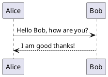

# PlantUML — text-driven diagrams for reproducibility

PlantUML is a text-based diagram language that generates UML and other diagrams (sequence, class, component, state, deployment) from plain text. It's great for reproducible diagrams, embedding in documentation, and versioning in Git.

## When to use PlantUML

- You want diagrams to be code-first: source-controlled, reviewable in PRs, and regenerable.
- You need sequence diagrams, class diagrams, or simple architecture diagrams generated from text.

## Quickstart

1. Write a PlantUML block (example below) and render with local PlantUML jar, VSCode PlantUML extension, or an online renderer.

Example sequence diagram:

2. Render to PNG/SVG and include in docs or commit the `.puml` files to your repo.

## Great example uses

- Sequence diagrams for API interactions and async flows
- Component and deployment diagrams for infra architecture
- Class diagrams generated from code metadata (via tools)

## Versioning & automation

- Keep `.puml` files in Git so changes to diagrams are reviewed with PRs.
- Add a CI job that renders `.puml` files to SVG and commits artifacts to `assets/img/` for the site.

## Tips for maintainability

- Keep PlantUML fragments small and focused; compose larger diagrams from included files.
- Use parameters and includes to avoid duplication.

## Helpful resources

- PlantUML official site: https://plantuml.com/
- PlantUML server / online renderers and VSCode extension for live preview.

---
