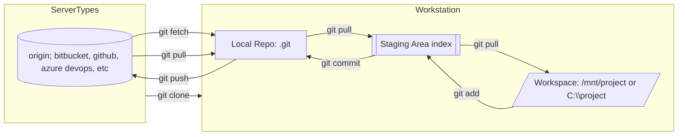
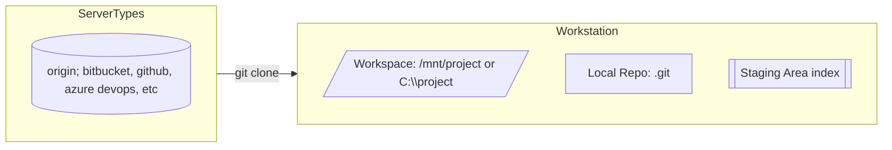

# Git for Beginners

A practical, beginner‑friendly introduction to Git’s decentralized model and the everyday workflows you’ll use. Keep this page handy when starting a new project or joining an existing one.

## Decentralized Version Control (DVCS)

- **Every clone is a full repository:** Your workstation has the entire history in a hidden folder named `.git`. You can commit locally without a network.
- **Servers host remotes:** Platforms like GitHub, GitLab, Bitbucket, and Azure DevOps store shared copies (“remotes”) so teams can collaborate.
- **Local workflow:** Edit files in your workspace → stage changes → commit to your local repo → push to the remote.

### Diagram: Server, Workspace, Staging, Local Repo



---

## Get a Repo from Server to Workstation (Clone)



1. Pick a folder for your workspace (examples):
	- Linux: `/mnt/work/cool-app` or `~/dev/cool-app`
	- Windows: `C:\Users\you\dev\cool-app`
2. Clone the remote:
	```bash
	git clone https://github.com/your-org/cool-app.git
	cd cool-app
	```
	Prefer SSH if allowed (fewer credential prompts):
	```bash
	git clone git@github.com:your-org/cool-app.git
	```
3. Confirm your remote:
	```bash
	git remote -v   # should show origin with fetch/push URLs
	```

---

## Create a New Local Repo and Push to Remote

1. Initialize locally:
	```bash
	mkdir my-new-app && cd my-new-app
	git init
	git branch -M main
	echo "# My New App" > README.md
	git add README.md
	git commit -m "Initial commit"
	```
2. Add a remote and push:
	```bash
	git remote add origin https://github.com/your-org/my-new-app.git
	# or SSH: git remote add origin git@github.com:your-org/my-new-app.git
	git push -u origin main
	```

---

## Move Changes from Workspace → Staging → Local Repo → Server

1. See what changed:
	```bash
	git status
	git diff           # shows unstaged edits
	```
2. Stage files (selective or all):
	```bash
	git add path/to/file
	# or stage everything
	git add .
	```
3. Commit locally with a clear message:
	```bash
	git commit -m "Explain what changed and why"
	```
4. Sync with remote:
	```bash
	git pull --rebase    # optional: keep linear history
	git push             # publishes your commits
	```

---

## Servers & Workspaces

- **Servers (remotes):** GitHub, GitLab, Bitbucket, Azure DevOps. Remotes are named (commonly `origin`). A repo may have multiple remotes.
- **Workspaces:** Any folder on your machine (e.g., `/mnt/project`, `~/dev/project`, `C:\project`). The `.git` directory inside is the local repo; do not edit its contents manually.

---

## Minimal Setup & Auth

Set your identity once:
```bash
git config --global user.name "Your Name"
git config --global user.email "you@example.com"
git config --global init.defaultBranch main
```

Use SSH (recommended) or HTTPS:
```bash
# SSH keys
ssh-keygen -t ed25519 -C "you@example.com"
eval "$(ssh-agent -s)" && ssh-add ~/.ssh/id_ed25519
# Copy ~/.ssh/id_ed25519.pub into your Git host settings

# HTTPS with Personal Access Token (PAT) when SSH isn’t available
```

---

## Good Hygiene (Beginner‑friendly)

- **.gitignore:** Avoid committing secrets and build outputs.
  ```
  .env
  node_modules/
  dist/
  *.log
  ```
- **Commit messages:** Short imperative summary + optional details.
- **Small commits:** Easier to review and revert.
- **Pull before push:** Reduce conflicts by integrating upstream first.

---

## Troubleshooting Quick Wins

- "Permission denied (publickey)": Add your SSH key to the host; ensure `ssh-agent` has it.
- "Detached HEAD": Switch back to a branch: `git switch main`.
- "Diverged branches": Use `git pull --rebase` and resolve conflicts, then continue.

---

For branching strategies and intermediate topics, see:

- [gitflow.md](gitflow.md)
- [gitversion.md](gitversion.md)
- [gitops.md](gitops.md)

